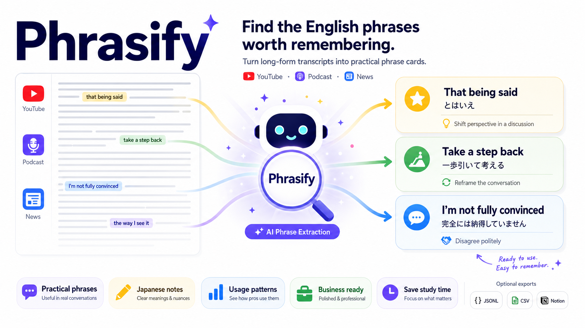

# Phrasify


`Phrasify` は、英語の長文 transcript から「実務でそのまま使える英語表現カード」を抽出する CLI ツールです。
デフォルトでは、日本語ネイティブのビジネスパーソン向け profile が入っています。特に VC、startup、finance、MBA などの文脈で、単語ではなく「発話で再利用できる表現の塊」を集める設定です。

Phrasify turns English transcripts into reusable expression cards. It ships with a Japanese business English profile by default, and OSS users can customize the learner, domains, expression focus, and explanation language with extraction profiles.

## 30 秒で試す

```bash
git clone https://github.com/<your-org>/phrasify.git
cd phrasify
python3 -m venv .venv
.venv/bin/pip install -e .
phrasify extract examples/sample_transcript.md --dry-run
phrasify export examples/sample_output.jsonl --format csv
```

## セットアップ

読み込み・整形・CSV / JSONL export などの基本処理には必須の外部依存はありません。LLM 抽出を実行する場合だけ、使う provider の SDK を入れてください。

```bash
git clone https://github.com/<your-org>/phrasify.git
cd phrasify
python3 -m venv .venv
.venv/bin/pip install -e '.[anthropic]'
# or: .venv/bin/pip install -e '.[openai]'
```

YouTube / Spotify / Podcast URL も入力にしたい場合は、media extra を入れます。

```bash
.venv/bin/pip install -e '.[media,anthropic]'
```

未インストールのまま開発実行する場合は、`PYTHONPATH=src` を付けます。

`ANTHROPIC_API_KEY` または `OPENAI_API_KEY` は `.env` に置きます。

```bash
cp .env.example .env
```

既定モデルは provider ごとに設定されています。明示したい場合は `--model` を使うか、`PHRASIFY_ANTHROPIC_MODEL` / `PHRASIFY_OPENAI_MODEL` を `.env` に置いてください。

## 使い方

loader / chunker だけ確認する dry-run:

```bash
PYTHONPATH=src python -m phrasify extract /path/to/transcript.md --dry-run
```

英語表現カードを JSONL で抽出:

```bash
PYTHONPATH=src python -m phrasify extract /path/to/transcript.md \
  --provider anthropic \
  --max-expressions 30
```

別の学習者・ドメイン向け profile で抽出:

```bash
PYTHONPATH=src python -m phrasify extract /path/to/transcript.md \
  --profile examples/software_engineering_profile.toml \
  --provider anthropic
```

YouTube URL から字幕を取得して、そのまま dry-run:

```bash
PYTHONPATH=src python -m phrasify extract "https://www.youtube.com/watch?v=VIDEO_ID" --dry-run
```

Podcast URL から transcript / 文字起こしを作成して Phrasify:

```bash
PYTHONPATH=src python -m phrasify extract "https://open.spotify.com/episode/EPISODE_ID" \
  --media-transcriber auto \
  --provider anthropic
```

Notion MCP handoff 用 JSON も同時に作る:

```bash
PYTHONPATH=src python -m phrasify extract /path/to/transcript.md --notion-handoff
```

既存の JSONL 出力を CSV に変換:

```bash
PYTHONPATH=src python -m phrasify export outputs/example_20260503.jsonl --format csv
```

複数 JSONL を横断集約し、正規化した expression で dedup:

```bash
PYTHONPATH=src python -m phrasify aggregate
```

`aggregate` は expression を小文字化し、空白と末尾の句読点を正規化して重複判定します。複数ファイルに同じ expression が出た場合は `frequency` と `source_ids` に集約され、最新の record が代表メタデータとして使われます。

## URL入力

Phrasify はローカル transcript ファイルだけでなく、YouTube / Spotify / Podcast の URL も `extract` に渡せます。URL入力では、まず文字起こし本文を取得し、`outputs/transcripts/` に Markdown として保存します。その Markdown を既存の loader / chunker / LLM 抽出に流すため、URL入力でも出力 schema や CSV export の扱いは通常の transcript と同じです。

URL取得機能は Phrasify 内で完結しています。個人のローカル環境や別リポジトリの `tools/` ディレクトリには依存しません。

### YouTube

YouTube URL は字幕取得を優先します。

1. URL から video ID を抽出
2. `youtube-transcript-api` で字幕一覧を取得
3. `--media-lang` の優先順で手動字幕を探す
4. 手動字幕がなければ自動生成字幕を探す
5. 字幕が取れず、`--media-transcriber auto` の場合は OpenAI transcription にフォールバック
6. フォールバック時は `yt-dlp` で音声を取得し、OpenAI transcription で文字起こし

字幕だけを使いたい場合:

```bash
PYTHONPATH=src python -m phrasify extract "https://www.youtube.com/watch?v=VIDEO_ID" \
  --media-transcriber captions \
  --dry-run
```

字幕ではなく音声から文字起こししたい場合:

```bash
PYTHONPATH=src python -m phrasify extract "https://www.youtube.com/watch?v=VIDEO_ID" \
  --media-transcriber openai \
  --transcribe-lang en \
  --dry-run
```

### Spotify

Spotify episode URL では、Spotify から音声を直接取得しません。Spotify は episode metadata の取得に使い、実音源は Apple Podcasts RSS から探します。

1. Spotify episode URL から episode ID を抽出
2. Spotify ページの OpenGraph / JSON-LD からエピソードタイトル、番組名、公開日、長さを取得
3. 番組名で Apple Podcasts / iTunes Search API を検索
4. Apple RSS feed 内でエピソードタイトルに近い entry を探す
5. RSS entry の audio enclosure URL を取得
6. 音声 URL を OpenAI transcription に渡して文字起こし
7. Apple RSS や transcription が失敗した場合は、番組名 + エピソードタイトルで YouTube を検索し、字幕取得を試す

```bash
PYTHONPATH=src python -m phrasify extract "https://open.spotify.com/episode/EPISODE_ID" \
  --media-transcriber auto \
  --transcribe-lang en \
  --provider anthropic
```

### Podcast / RSS / Audio URL

一般的な Podcast URL は、公開 transcript があればそれを優先します。

1. RSS URL なら RSS XML を読む
2. 通常の Podcast ページなら `<link type="application/rss+xml">` から RSS feed を探す
3. RSS entry から `podcast:transcript` などの transcript URL を探す
4. transcript URL があれば、その本文を取得して transcript Markdown に保存
5. transcript URL がない場合は audio enclosure URL を取得
6. audio URL を OpenAI transcription に渡して文字起こし

MP3 などの audio URL を直接渡した場合は、その音源を OpenAI transcription に渡します。

### URL入力に必要なもの

| 機能 | 必要なもの |
| ---- | ---------- |
| YouTube字幕取得 | `.[media]` |
| YouTube / Podcast の音声ダウンロード | `.[media]` と `yt-dlp` |
| OpenAI transcription | `OPENAI_API_KEY` |
| 長尺音声の再エンコード / 分割 | `ffmpeg` / `ffprobe` |
| Phrasify の LLM 抽出 | `ANTHROPIC_API_KEY` または `OPENAI_API_KEY` |

`--dry-run` は LLM 抽出を行わず、文字起こし取得、loader、chunking だけを確認します。ただし、字幕がなく音声 transcription にフォールバックする場合は、`--dry-run` でも OpenAI transcription を呼びます。

## 抽出 profile

Phrasify の抽出方針は profile で変更できます。デフォルト profile は日本語ネイティブのビジネスパーソン向けですが、OSS ユーザーは自分の用途に合わせて次の要素を差し替えられます。

- 対象学習者
- 学習者レベル
- 対象ドメイン
- 使う場面
- 優先して抽出する表現タイプ
- 避けたい表現
- 説明・翻訳に使う言語

Profile は TOML または JSON で指定します。

```toml
name = "software_engineering"
role = "expert English learning material designer for software professionals"
learner = "a non-native English-speaking software engineer who wants to sound clearer in technical leadership discussions"
level = "CEFR B2-C1"
explanation_language = "English"
domains = ["software engineering", "product development", "architecture reviews"]
situations = ["design reviews", "roadmap discussions", "incident reviews"]
focus = ["technical tradeoff expressions", "alignment and clarification phrases"]
avoid = ["company-specific facts", "tool names that are not reusable"]
learner_lift_description = "Would this help the learner express technical judgment, nuance, or collaboration more naturally than a literal translation?"
example_context = "We should call out the tradeoff before we commit to this architecture."
tags_hint = ["engineering", "leadership", "collocation"]
categories = ["technical", "leadership", "alignment", "risk", "proposal", "collocation"]
```

実行例:

```bash
PYTHONPATH=src python -m phrasify extract examples/sample_transcript.md \
  --profile examples/software_engineering_profile.toml \
  --provider anthropic
```

一時的に CLI から上書きすることもできます。

```bash
PYTHONPATH=src python -m phrasify extract examples/sample_transcript.md \
  --learner "a French founder preparing for investor updates" \
  --learner-level "advanced" \
  --explanation-language French \
  --domains fundraising investor_updates \
  --focus "concise update phrases" "polite pushback expressions" \
  --provider anthropic
```

互換性のため、出力 JSON の field names は固定です。たとえば `jp_translation`、`nuance`、`usage` という名前は残りますが、`explanation_language` を変えると中身は指定した言語で生成されます。同様に `japanese_speaker_lift` は schema 互換の field name として残しつつ、profile で定義した学習者にとっての「自然に産出しにくいが価値が高い表現」を評価するスコアとして使います。

完全に独自のプロンプトを使いたい場合は `--prompt /path/to/prompt.md` を指定できます。この場合、profile からのプロンプト生成は使われません。

### 自然文から profile を作る

Profile ファイルを手で書かなくても、自然文の説明から LLM に profile を生成させることができます。

```bash
PYTHONPATH=src python -m phrasify profile create \
  "I am a French founder preparing for investor updates. I want concise English phrases for fundraising, board updates, and polite pushback." \
  --out profiles/founder_updates_fr.toml \
  --provider anthropic
```

長めに説明したい場合はテキストファイルから読み込めます。

```bash
PYTHONPATH=src python -m phrasify profile create \
  --from-file my-profile-request.txt \
  --out profiles/my-profile.toml \
  --provider openai
```

生成された profile は通常の profile と同じように使います。

```bash
PYTHONPATH=src python -m phrasify extract transcript.md \
  --profile profiles/founder_updates_fr.toml \
  --provider anthropic
```

`profile create` は profile 生成のために LLM provider を呼びます。`ANTHROPIC_API_KEY` または `OPENAI_API_KEY` を `.env` に設定してください。

## 主なオプション

| option                      | 説明                                       |
| --------------------------- | ------------------------------------------ |
| `--provider`              | `anthropic` / `openai` を選択          |
| `--model`                 | provider の model 名を明示                 |
| `--profile`               | 抽出 profile JSON/TOML を指定              |
| `--learner`               | profile の対象学習者を一時上書き           |
| `--learner-level`         | profile の学習者レベルを一時上書き         |
| `--explanation-language`  | `jp_translation` / `nuance` / `usage` の説明言語 |
| `--domains`               | 対象ドメインを一時上書き                   |
| `--focus`                 | 優先して抽出する表現タイプを一時上書き     |
| `--output-dir`            | 生成物の保存先。既定は実行ディレクトリの `outputs/` |
| `--max-expressions`       | 抽出する最大 expression 数                 |
| `--chunk-max-chars`       | 1 chunk あたりの最大文字数                 |
| `--min-native-reusable-score` | native reusable score が低いカードを除外 |
| `--max-too-basic`         | 基礎的すぎるカードを除外する上限             |
| `--max-too-context-specific` | 文脈依存すぎるカードを除外する上限          |
| `--no-nlp-hints`          | NLP 候補ヒントを LLM に渡さない              |
| `--format`                | `jsonl` / `json` / `csv`             |
| `--notion-handoff`        | Notion MCP handoff JSON を生成             |
| `--notion-database-id`    | handoff payload に database ID を含める    |
| `--notion-data-source-id` | handoff payload に data source ID を含める |
| `--media-transcriber`     | URL入力時の取得方法。`auto` / `captions` / `openai` |
| `--media-lang`            | YouTube字幕の優先言語                       |
| `--transcribe-lang`       | OpenAI transcription の言語ヒント           |
| `--transcribe-prompt`     | OpenAI transcription の固有名詞ヒント       |
| `--transcript-dir`        | URL由来 transcript Markdown の保存先        |

## サンプル

```bash
PYTHONPATH=src python -m phrasify extract examples/sample_transcript.md --dry-run
PYTHONPATH=src python -m phrasify export examples/sample_output.jsonl --format csv
```

## Claude Code / Codex で skill として使う

Phrasify は CLI として直接使えるだけでなく、Claude Code や Codex などの coding agent から呼び出しやすいように `skills/phrasify/SKILL.md` を同梱しています。skill を登録すると、agent は Phrasify の安全な実行手順を読んだうえで、transcript の dry-run、LLM 抽出、CSV export、Notion handoff 生成を進められます。

### Codex ユーザー向け

Codex の user skill として使う場合:

```bash
mkdir -p ~/.codex/skills
cp -R skills/phrasify ~/.codex/skills/
```

その後、Codex のセッションで次のように依頼します。

```text
$phrasify を使って、この transcript から英語表現カードを抽出してください。
入力: /path/to/transcript.md
出力は JSONL と CSV の両方でお願いします。
```

Codex が repo 内で作業している場合は、Phrasify の repository root、または既に `phrasify` が入っている environment を見つけ、まず `phrasify extract ... --dry-run` で loader / chunking を確認してから、本抽出に進む想定です。

### Claude Code ユーザー向け

Claude Code の user skill として使う場合:

```bash
mkdir -p ~/.claude/skills
cp -R skills/phrasify ~/.claude/skills/
```

Claude Code では、以下のように明示的に skill 名を含めると意図が伝わりやすくなります。

```text
$phrasify を使って、/path/to/transcript.md から実務英語表現を抽出してください。
まず dry-run で入力を確認し、問題なければ JSONL を作って、最後に CSV に変換してください。
```

プロジェクトで共有したい場合は、リポジトリ内に `skills/phrasify/` を置いたままにして、README や agent 用の project instructions から参照させる運用が向いています。ユーザー個人の全プロジェクトで使いたい場合だけ、`~/.claude/skills` や `~/.codex/skills` にコピーしてください。

### Skill が agent に伝えること

- `.env` や API key を表示しない
- `extract` は transcript chunk を選択した LLM provider に送る
- `export` と `aggregate` はローカルファイルだけを処理する
- まず dry-run で loader / chunking を確認する
- `outputs/` の生成物は原則 git commit しない
- Notion ID は user が明示した場合だけ使い、コードや docs に固定値を書かない

### よく使う依頼例

```text
$phrasify でこの Markdown から表現カードを抽出して、CSV も作ってください。
```

```text
$phrasify で outputs/example.jsonl を Notion handoff JSON に変換してください。
Notion target ID はまだ入れないでください。
```

```text
$phrasify の抽出結果を確認して、expression_in_source が false のカードを優先レビュー候補としてまとめてください。
```

## 入力形式

- `.md`
- `.txt`
- `.srt`
- `.vtt`
- YouTube URL
- Podcast URL / RSS URL / audio URL

## 出力

デフォルトでは以下の JSONL を作ります。

- `outputs/<transcript>_<YYYYMMDD>.jsonl`

必要に応じて CSV や Notion handoff JSON も生成できます。

### 出力 schema 例

```json
{
  "seq": 1,
  "expression": "double down on",
  "original_sentence": "We should double down on founder-led sales.",
  "jp_translation": "創業者主導の営業にさらに注力すべきです。",
  "nuance": "確信を持って追加投資・集中するニュアンス。",
  "usage": "戦略、投資判断、営業・市場選択の文脈で使う。",
  "pattern": "double down on + noun",
  "reusable_examples": [
    "We should double down on enterprise customers before expanding internationally."
  ],
  "tags": ["collocation", "strategy"],
  "source": {
    "file": "examples/sample_transcript.md",
    "chunk_id": "sample_transcript-001"
  },
  "scores": {
    "usefulness": 0.9,
    "reusability": 0.9,
    "executive_naturalness": 0.86,
    "silicon_valley_fit": 0.92,
    "mba_interview_fit": 0.72,
    "japanese_speaker_lift": 0.88,
    "too_basic": 0.12,
    "too_context_specific": 0.08,
    "native_reusable_score": 0.78,
    "source_confidence": 0.95
  },
  "review_status": "New",
  "expression_in_source": true,
  "original_sentence_in_source": true
}
```

### 品質指標

- `expression_in_source`: `expression` が transcript chunk 内に文字列として存在するか
- `original_sentence_in_source`: `original_sentence` が transcript chunk 内に存在するか
- `native_reusable_score`: 他の場面で再利用でき、自然なビジネス英語として使える度合い
- `japanese_speaker_lift`: 日本語話者が「単語は知っているが、とっさに自然に出せない」発話フレームとして学ぶ価値
- `too_basic`: B2+ 学習者には基礎的すぎる可能性
- `too_context_specific`: transcript 固有の事実に閉じすぎている可能性

LLM は学習しやすい形に正規化することがあるため、`expression_in_source` は false になる場合があります。原文 grounding を重視する場合は、この値を review queue の優先度付けに使います。`native_reusable_score` は `reusability`、`executive_naturalness`、`silicon_valley_fit`、`mba_interview_fit`、`japanese_speaker_lift` から加点し、`too_basic` と `too_context_specific` を減点して Phrasify 側で計算します。

## Privacy

`extract` を実行すると、入力 transcript の本文が指定した LLM provider（Anthropic または OpenAI）に送信されます。API key はローカルの environment variable から読み、Phrasify は key を出力ファイルに保存しません。

URL入力では、字幕、RSS、Podcastページ、音声ファイルなどを取得するために対象サービスへネットワークリクエストを送ります。OpenAI transcription にフォールバックする場合は、取得した音声が OpenAI に送信されます。YouTube字幕や公開 transcript URL だけで本文が取れた場合、音声は OpenAI transcription に送りません。

生成物はデフォルトで `outputs/` に保存されます。`outputs/` は `.gitignore` されているため、`.gitkeep` 以外の生成物は git 管理外です。

Notion 連携は直接書き込みではなく、MCP handoff 用 JSON を生成するだけです。Notion target metadata を入れたい場合は `--notion-database-id` / `--notion-data-source-id`、または `PHRASIFY_NOTION_DATABASE_ID` / `PHRASIFY_NOTION_DATA_SOURCE_ID` を使います。

## FAQ

### Anki に入れられますか？

現時点では CSV export を使って取り込めます。将来的には `--format anki-csv` を追加する想定です。

### transcript はどこに送られますか？

`extract` では、選択した LLM provider に transcript chunk を送ります。`export` と `aggregate` はローカルファイルだけを処理します。

URL入力の場合、Phrasify はまず取得した文字起こし本文を `outputs/transcripts/` に Markdown として保存します。その後の LLM 抽出では、その Markdown から読み込んだ transcript chunk が provider に送られます。

### YouTube字幕がある場合も OpenAI transcription を使いますか？

既定の `--media-transcriber auto` では字幕を優先します。字幕が取得できた場合は OpenAI transcription を使いません。音声から文字起こししたい場合は `--media-transcriber openai` を指定してください。

### Spotifyの音声はSpotifyから直接取得しますか？

いいえ。Spotify URL は metadata 取得に使います。番組名とエピソードタイトルから Apple Podcasts RSS の音源を探し、その audio enclosure URL を transcription に使います。Apple RSS で見つからない場合は YouTube字幕 fallback を試します。

### 日本語以外の学習者にも使えますか？

使えます。デフォルト profile は日本語ネイティブのビジネス英語向けですが、`--profile` や `--explanation-language` で別の学習者・言語・ドメイン向けに変更できます。

## ディレクトリ構成

- `src/phrasify/`: 本体コード
- `src/phrasify/profiles.py`: 抽出 profile の読み込みとプロンプト生成
- `src/phrasify/prompts/extract.md`: 互換用の抽出プロンプト例。通常は profile からプロンプトを生成
- `examples/software_engineering_profile.toml`: profile カスタマイズ例
- `tests/`: 標準ライブラリ `unittest` によるテスト
- `outputs/`: ローカル生成物（JSONL / CSV / Notion handoff）。`.gitkeep` 以外は git 管理外

## 開発

```bash
PYTHONPATH=src python -m unittest discover -s tests -v
```

LLM API を叩かない処理は stdlib `unittest` で検証します。provider SDK は必要なものだけ optional dependency として入れます。

### Optional NLP

spaCy を入れると、noun chunks / verb phrases / discourse markers を候補ヒントとして LLM に渡し、lemma-based source grounding や `too_basic` / `too_context_specific` の補助判定にも使います。

```bash
.venv/bin/pip install -e '.[nlp]'
python -m spacy download en_core_web_sm
```

spaCy や model が入っていない場合も、Phrasify は regex fallback で基本的な発話フレーム候補を抽出します。
